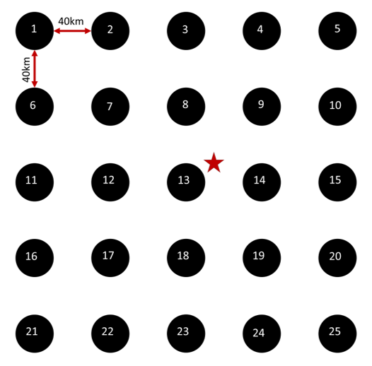

# SevereWindMachineLearning
Machine learning approach to predict the probability that a severe wind report was caused by severe intensity wind (greater than or equal to 50 knots)

* Working codes to quality control the data, train the machine learning models, and make predictions are in progress and will be published upon completion

##### Table of Contents  
[Data](#data)  
[Codes](#codes)
[Methodology](#detailed-methodology)
[Citation](#citation)

# Data
Wind reports have speeds that were either measured (MG) or estimated (EG). The machine learning models were only trained on MG, but predictions can be made on estimated, however, due to the nature of the reports, skill metrics cannot be calculated on estimated reports since they have no ground truth measurements corresponding to them. 
1. WindReports
   * Contain wind reports from 2007-2018 that were used to train and test the machine learning models
   * Data from 2007-2017 have been quality controled to remove reports with speeds < 30 kt with changes between start and end times > 20 minutes
2. EnvironmentalFeatures
   * Contain wind reports from 20017-2018 with environmental features used in training/testing
   * SPC mesoanalysis data are labeled as NAME_point with "NAME" corresponding to the variable name (see table) and "point" referencing the number on the grid (see diagram below)
   * Elevation and population are columns at the end of each row (labeled)

### Mesoanalysis Parameters
  | Name (unit) | Description |
  |-------|------------|
  | SBCP (J kg^{-1}) | Surface based CAPE |
  | SBCN (J kg^{-1}) | Surface based CIN | 
  | MUCP (J kg^{-1}) | Most unstable CAPE |
  | MUCN (J kg^{-1}) | Most unstable CIN |
  | LR75 (C km^{-1}) | Lapse rate from 700 - 500 mb | 
  | LR85 (C km^{-1}) | Lapse rate from 850 - 500 mb |
  | LPS4 (C km^{-1}) | Lapse rate from surface to 400 mb |
  | RH80 (%) | Relative humidity at 800 mb |
  | RH70 (%) | Relative humidity at 700 mb |
  | 3KRH (%) | 3 km average relative humidity |
  | SLCH (m) | Surface based LCL height |
  | RHLC (%) | Average relative humidity LCL to LFC |
  | DNCP (J kg^{-1}) | Downdraft CAPE |
  | M1CP (J kg^{-1}) | 100 mb mean mixed CAPE |
  | M1CN (J kg^{-1}) | 100 mb mean mixed CIN | 
  | UWND (kt) | Surface U wind component |
  | VWND (kt) | Surface V wind component |
  | UPMW (kt) | Surface to 6 km pressure-weighted U component |
  | VPMW (kt) | Surface to 6 km pressure-weighted V component |
  | SRH3 (m^2 s^{-2} | Surface to 3 km SRH |
  | U6SV (kt) | Surface to 6 km U shear comonent |
  | V6SV (kt) | Surface to 6 km V shear comonent |
  | U8SV (kt) | Surface to 8 km pressure weighted U component |
  | V8SV (kt) | Surface to 8 km pressure weighted V component |
  | S6MG (kt) | Surface to 6 km shear magnitude |
  | UEIL (kt) | U component at top of effective inflow layer |
  | VEIL (kt) | V component at top of effective inflow layer |
  | QTRN (g kt kg^{-1}) | Max mixing ratio X storm relative inflow at MUPL |
  | XTRN (g kt kg^{-1}) | Max mixing ratio X wind speed at MUPL |
  | WNDG (numeric) | Wind damage parameter |
  | EDCP (numeric) | Evans Derecho Composite parameter |

### Grid Numbering for Mesoanalysis data
* Schematic for mesoanalysis data
* Star represents hypethetical location of a wind report
* Center point of the grid will be the closest gridpoint to the wind report location

# Codes
* Codes are being edited for broad use and will be available in time

# Detailed Methodology
#### Wind Reports
* Wind reports are downloaded in bulk by year from https://www.ncdc.noaa.gov/stormevents/
* Time information is changed from local time to UTC
* If the difference from the start time to the end time is greater than 20 minutes, report is removed from the training set
* Times are expressed using the start time
* Reports with wind speeds less than 30 kts are removed from training set
* Training was conducted using measured (MG) wind reports from 2007-2017 and the test set uses MG from 2018

#### Text Processing
* Event and episode narratives are merged since many reports are missing event narratives
* 

#### Mesoanalysis Data
* 31 parameters from SPCs mesoanalysis dataset (see table above)
* Data are collected on a 5 x 5 model grid with the center point representing the closest model grid point to the storm report location
* Mesoanalysis data are hourly data so we chose the hour prior to the start of the report - for example a report falling at 11:27 UTC would be assigned the 11 UTC mesoanalysis data
* 

#### Elevation and Population

#### Sub-Severe

#### Machine Learning

# Citation
Any use of the data in this GitHub repository should cite this (in review):

@unpublished{tirone_machine_2023,
	address = {Bulletin of the American Meteorological Society},
	title = {A machine learning approach to improve the usability of severe thunderstorm wind reports},
	author = {Tirone, Elizabeth and Gallus, William A. and Pal, Subrata and Dutta, Somak and Maitra, Ranjan and Newman, Jennifer and Weber, Eric and Jirak, Israel},
	year = {2023},
}
